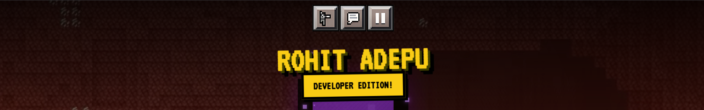

<div align="center">

</div>

<h1 align="center">⚔️ Rohit Adepu's Interactive Portfolio ⛏️</h1>

<p align="center">
  <strong>A highly interactive, gamified, and pixel-perfect personal portfolio built with React & Tailwind CSS.</strong>
</p>

<p align="center">
  <a href="buymeacoffee.com/rohit_adepu" target="_blank">
    
  </a>
</p>

## ✨ Features

- 🎮 **Gamified UI/UX**: An immersive Minecraft-style interface complete with a HUD, hotbar, blocky fonts, and pixel art.
- 💬 **Live Community Hub**: A real-time chat room and "server" like system powered by **Supabase**. Set your username and interact with other visitors! 
- 🛡️ **Profanity Filter Built-In**: The community chat is actively moderated to block negative language and vulgarity.
- 👻 **Interactive Ghast**: A fully animated Minecraft Ghast follows your cursor and reacts on click!
- 📊 **Player Stats**: Dive into skill levels mapped like RPG attributes and a fully immersive player radar chart.
- 📜 **Quest Log**: Experience timeline styled as an active player quest log.
- 📱 **Fully Responsive**: Carefully crafted to look perfect on desktops, tablets, and phones.

## 🛠️ Tech Stack

- **Frontend Framework**: React + TypeScript ⚛️
- **Styling**: Tailwind CSS 🎨
- **Backend/Realtime DB**: Supabase 🗄️
- **Animations/Icons**: Framer Motion & Custom SVG Pixel Art ✨
- **Moderation**: `bad-words` JS package 🚫

## 🚀 Running Locally

Want to explore the source code and run the "server" yourself? It's easy!

**Prerequisites:** Node.js (v16+)

1. **Clone & Install Dependencies**
   ```bash
   npm install
   ```

2. **Configure Environment Variables**
   Set your Supabase API keys inside `services/supabase.ts` or through an `.env` file containing:
   ```env
   VITE_SUPABASE_URL=your_supabase_project_url
   VITE_SUPABASE_ANON_KEY=your_supabase_anon_key
   ```
   *(Note: The `comments` and `global_stats` tables need to be set up on your database before running the live hub feature).*

3. **Start the Game (Development Server)**
   ```bash
   npm run dev
   ```
   *Your portfolio should now be running at `http://localhost:5173` (or the port specified in your terminal).*

## 🤝 Contributing

Found a bug? Want to add a new Minecraft feature? 
1. Fork the Project
2. Create your Feature Branch (`git checkout -b feature/AmazingBlock`)
3. Commit your Changes (`git commit -m 'Add some AmazingBlock'`)
4. Push to the Branch (`git push origin feature/AmazingBlock`)
5. Open a Pull Request

---
<p align="center">
  Crafted with ❤️ and Redstone magic by <a href="https://github.com/rohitadepu07">Rohit Adepu</a>. 
  <br/>
  <i>No Creepers were harmed in the making of this portfolio.</i>
</p>
